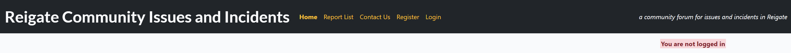
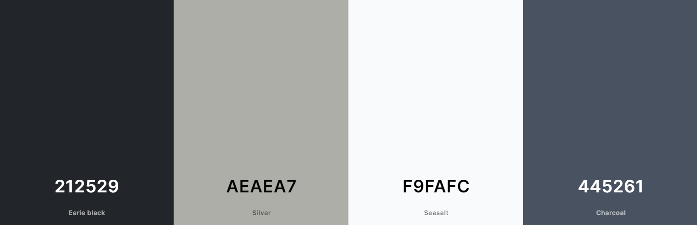
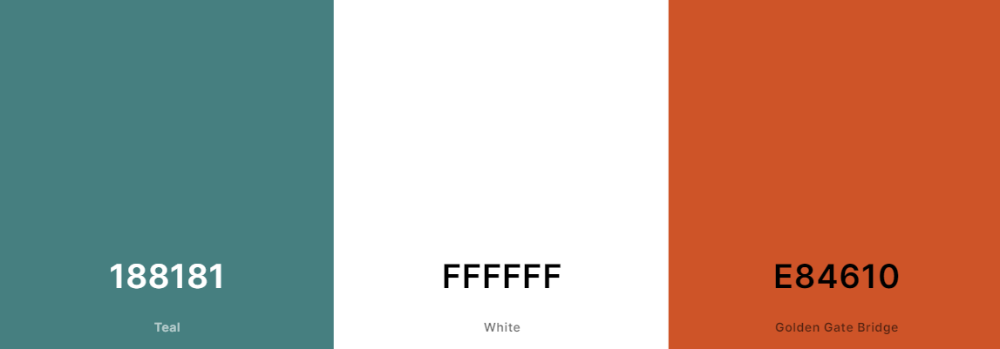
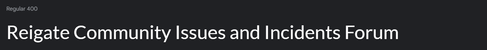

# The Reigate Community Issues and Incidents Forum

Live version: [Reigate Community Issues and Incidents Forum](https://)

Repository: [GitHub repository](https://github.com/JL-14/community-incident-forum)

The app is developed by [Jorgen Lovbakke](https://github.com/JL-14)

## About the Reigate Community Issues and Incidents Forum

The Reigate Community Issues and Incidents Forum is a platform designed to provide residents and visitors to Reigate
with up-to-date information about what is happening in their local area. The website pulls together information and
updates from official sources (such as local authorities, police, schools) about events, incidents, road closures,
works, etc, and information from residents and visitors about things they have seen or experienced, such as issues
affecting traffic, roads, fly-tipping, anti-social behaviour, and other things that affect day-to-day lives in Reigate.

Prior to the launch of the Reigate Community Issues and Incidents Forum information about the local area and issues
affecting everything from transport and planned road closures to the walk in and out of the town centre was not
available in any one place. Furthermore, there was no forum for sharing local occurrences and concerns that may have an
impact on other residents and visitors. The Reigate Community Issues and Incidents Forum thus brings together this
information in one place, enabling residents to be aware of any issues and make informed decisions about their daily
lives.

The Reigate Community Issues and Incidents Forum is designed to be informative, up-to-date, interactive, and
user-friendly for residents and visitors alike.

## UX Design

### Strategy

The site has been developed for use by residents and visitors to Reigate (but is easily adaptable to other towns and
cities). The main goal of the site is to provide a forum for sharing information about issues and incidents residents
and visitors have experienced, which alongside information from the authorities, will ensure that users know what is
happening in their local area. This has been achieved by the use of a simple and intuitive interface where the
information takes centre-stage. 

The site has additional functionalities, such as the ability to register and log in securely in order to comment and 
provide updates on reports, as well as edit comments and updates. The site is managed by administrative superusers who
review and approve content before it is posted on the site.

### Target audience

The target audience for site can be divided into:

* Residents: The core audience for the site are the residents of Reigate and its immediate surroundings.
* Visitors: To a lesser extent than for residents, the site will also be of use to visitors to the town and commuters,
enabling informed decision-making about travel, routes, accommodation, activities, etc.
* Local authorities: Through the provision of user-generated information about issues in the local area, local
authorities will be able to see hazards and issues that may not have been reported to them.

### User Stories

#### First-time user

As a first-time visitor to the site, I want to:
* see an informative front page, so that I clearly understand what the site is about
* easily be able to navigate through the app using intuitive links, so that I can easily find what I am looking for
* see all the reported issues and incidents in a list, so that I can find any that are relevant to me
* be able to click on any report listed, so that I can get more detail where available
* be able to see any images of the issue or incident, to give me a clear sense of what and where it is
* I want to be able to easily register for the site, so that I can make full use of the comment/ update function

#### Frequent user

As a frequent user of the site, I want to:
* easily be able to log in, so that I can use comment and update functionality
* be able to comment and post updates on reports I see on the site, so that I can provide other users with the latest
information
* be able to have images uploaded on the site when alerting users to new issues and incidents, so that I can clearly
show the issue I am referring to
* be able to edit or delete comments and updates I post, so that I am in control of the content I post on the site
* be able to easily contact the forum owners and administrators, so that I can submit new reports or let them have any
comments or suggestions I may have

#### Admin user
As an admin user, I want to:
* be able to easily manage both the front- and back-end of the site, so that I can make any changes necessary
* be able to moderate content through having new reports go through me and comments approved by me before posting, so
that I have overall control over the site
* be able to monitor usage of the site in terms of visits, so that I can make decisions about
whether to further promote the site
* be able to see a list of registered users, so that I can see who is posting and what they are posting
* be alerted to new submissions through a dedicated e-mail for new reports, so that I can act swiftly when receiving
new content

## Future Development

## Technologies used

### Languages
* HTML for the site content
* CSS for site design and layout
* JavaScript for user interaction on the site for automatically (specifically for the edit and delete capabilities)
* Python as back-end programming language
* PostgreSQL for relational database management.

### Frameworks
* Bootstrap as front-end CSS framework for modern responsiveness and pre-built components, with
- Summernote as Bootstrap tool for managing the appearance and functionality of the administrative parts of the site
* Django as Python framework for the site, with
- Crispy Forms as Django framework for managing the appearance and functionality of the comment form

### Databases and storage
* [ElephantSQL](https://www.elephantsql.com/) as Postgres database (please note that ElephantSQL will cease operations in January 2025)
* Cloudinary for static file storage

### Integrated Development Environment (IDE)
* VS Code used as main coding environment
* GitPod used as backup IDE

### Version control and Deployment
* Git for version control
* GitHub for the online repository
* Heroku used for hosting the deployed app

### Other tools
#### Wireframes
- Balsamiq for the creation of wireframes for the site
- 
#### Agile working tools
* GitHub Projects used to manage the Agile working approach for the project

#### Entity Relationship Diagram (ERD)
* Lucidchart for the creation of the ERD

## Features
The following is a description of the features and functionality of the site. Please see the [testing](Testing) section for details of all aspects of functionality.

### Navbar
The navbar is fixed in place, and appears on all pages. It features the site logo ('Reigate Community Issues and Incidents') in the top left corner (which also serves as a link to the Home page), and navigation links next to the logo. The navigation links are a dark orange to set them apart from the logo and tagline, and will take the user to the Home page, the Report List page, and the Contact Us page. On first arriving at the site, there is an option to Register as a new user of the site, which opens a registration form which creates a new account. There is also an option to Log In (for existing users), which opens the login page where username and password allows the user to log in. There is a red box to the right of the screen which informs visitors that 'You are not logged in', which changes to a green box to inform users that 'You are logged in as (username)' once logged in. These boxes stay visible throughout the site. Finally, on the right hand side of the screen, there is a tagline which reads 'a community forum for issues and incidents in Reigate'.

### Footer
The Footer is at the bottom of the screen, and is reached by scrolling down. At the centre of the Footer there is a copyright message ('Copyright Jorgen Lovbakke 2024') and an option to 'Follow us' with icons linking to Facebook, Twitter/ X, Instagram, and YouTube.

### Home page
The Home page introduces the site, including the rationale and instructions on how to use the site and contact the developer. There is a section with highlighted text (bold in red) emphasising to visitors that the site is not linked to the emergency services or official local government channels, and that in the case of an emergency they should phone 999.

### Report List page
The Report List page lists the posts on the site, ordered chronologically by the date and time of the issue or incident reported. The posts have an image (relevant to the post if the person reporting it has supplied an image, or a placeholder image -the main image for the site), a banner with the username of the person who reported it, and the title and date of time of the issue that was reported. There are a maximum of 6 reports listed on a page, with Next and Back buttons at the bottom of the page for accessing more reports. The user can click on any report to see the full details of the issue or incident in question.

### Report details page
On the Report Details page the title, author, and date and time of the issue or incident are set out next to the image supplied by the person making the report (or the placeholder image if no image was provided). The detailed content of the report is then set out below the image and title. Below the contents there is space for comments and/ or updates, which can be provided by registered users who are logged in by clicking the 'Add a Comment' button (which is only visible to logged in users). The comment section has full CRUD functionality (enabling users to Create comments, Read the comments, Update comments, and Delete comments) giving users full control over content they post to the site. To prevent erroneous or misleading information from being posted, comments will appear as shaded until approved by a user with administrative privileges. Feedback boxes appear when comments are submitted (saying that 'The comment is awaiting approval' or 'There was an error submitting, please try again'). Users who have submitted comments have the option of editing or deleting their comments through buttons to 'Delete' and 'Edit' underneath their comments (not for comments submitted by other users). For users who wish to delete their comments or updates, a box asks them to confirm that they want to delete the comment as this action cannot be undone, before a box appears confirming that 'Comment has been successfully deleted'. Users who wish to edit their comment or update are taken back to the Add a Comment form, where the original comment appears (to facilitate editing). On submitting the updated comment, a box appears to confirm that the comment has been updated, although the comment is shaded out and showing as awaiting approval so that the moderator can approve (or not) the updated comment. 

### Contact Us page
The Contact Us page has information on how to contact the forum, whether to to provide information about a new issue or incident, or to provide comments or suggestions. For new content, there is a link to a dedicated e-mail address ('report@reigatecommunityforum.co.uk') and instructions on what content needs to be included for a report to be created. Using an email-based submission process, the forum moderators have access to the submitters e-mail address for questions, queries, or missing information. There is a separate e-mail address for questions or suggestions for the moderators and developer ('info@reigatecommunityforum.co.uk').

## App design

### Colour scheme
The colour scheme for the site has been chosen to convey a degree of seriousness, reflecting that the site is
concerned with issues and incidents affecting the lives of residents and visitors in Reigate.

The colours used are:
#### Home page
* Header and footer: Black (#212529) with Grey font (#aeaea7)
* Background: Light grey (#f9fafc) with black font (#212529)
* Floating heading container (hex #445261, with 0.9 opaqueness)

#### Report List page
* Author banner in report list: Green (#188181) with white font (#ffffff)
* Font for individual report titles: Red (#e84610)

### Typography
The font type used for the site is Lato, which is clearly defined and carries an appropriate degree of gravity and
urgency for the site.

### Imagery
The main image and placeholder for the site shows the junction between Bell Street and High Street in Reigate, with the
old Town Hall tower in the background. The photo was taken by Joanne Lovbakke.

Additional images are submitted by users (relevant to the issue or incident) or provided by the relevant local
authority, and uploaded by admin to the Cloudinary storage facility for static files.

### Wireframes

## Agile Methodology

### GitHub Project Management

## Flowcharts

## Information Architecture

### Database

### Entity-Relationship Diagram

### Data Modelling

#### Models

## Testing

## Deployment

## Credits

### Content and Images

## Acknowledgements

