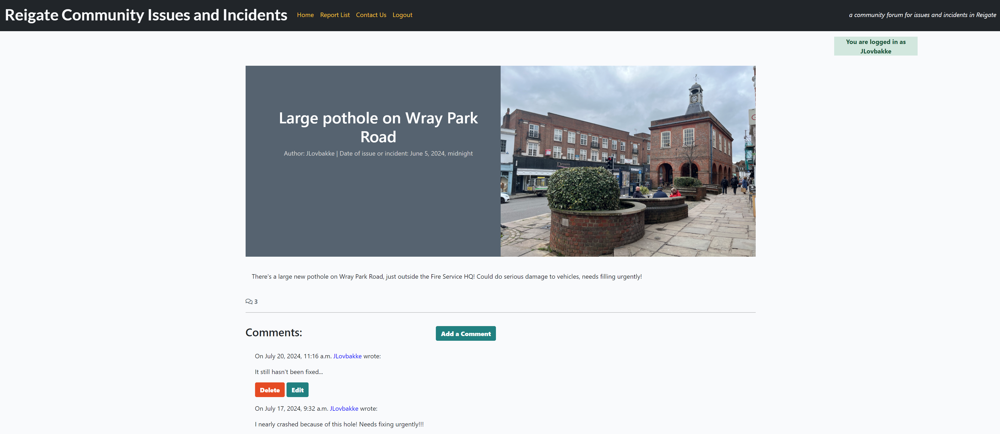
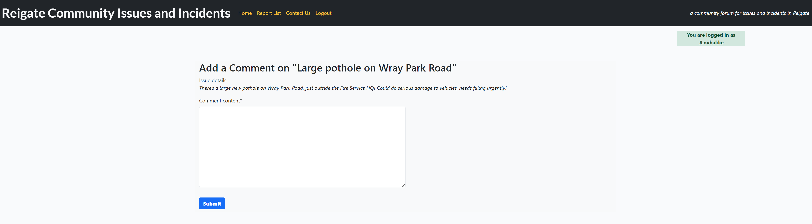

# The Reigate Community Issues and Incidents Forum

Live version: [Reigate Community Issues and Incidents Forum](https://)

Repository: [GitHub repository](https://github.com/JL-14/community-incident-forum)

The app is developed by [Jorgen Lovbakke](https://github.com/JL-14)

## About the Reigate Community Issues and Incidents Forum
The Reigate Community Issues and Incidents Forum is a platform designed to provide residents and visitors to Reigate
with up-to-date information about what is happening in their local area. The website pulls together information and
updates from official sources (such as local authorities, police, schools) about events, incidents, road closures,
works, etc, and information from residents and visitors about things they have seen or experienced, such as issues
affecting traffic, roads, fly-tipping, anti-social behaviour, and other things that affect day-to-day lives in Reigate.

Prior to the launch of the Reigate Community Issues and Incidents Forum information about the local area and issues
affecting everything from transport and planned road closures to the walk in and out of the town centre was not
available in any one place. Furthermore, there was no forum for sharing local occurrences and concerns that may have an
impact on other residents and visitors. The Reigate Community Issues and Incidents Forum thus brings together this
information in one place, enabling residents to be aware of any issues and make informed decisions about their daily
lives.

The Reigate Community Issues and Incidents Forum is designed to be informative, up-to-date, interactive, and
user-friendly for residents and visitors alike.

---

## UX Design
### Strategy
The site has been developed for use by residents and visitors to Reigate (but is easily adaptable to other towns and
cities). The main goal of the site is to provide a forum for sharing information about issues and incidents residents
and visitors have experienced, which alongside information from the authorities, will ensure that users know what is
happening in their local area. This has been achieved by the use of a simple and intuitive interface where the
information takes centre-stage. 

The site has additional functionalities, such as the ability to register and log in securely in order to comment and 
provide updates on reports, as well as edit comments and updates. The site is managed by administrative superusers who
review and approve content before it is posted on the site.

### Target audience
The target audience for site can be divided into:

* Residents: The core audience for the site are the residents of Reigate and its immediate surroundings.
* Visitors: To a lesser extent than for residents, the site will also be of use to visitors to the town and commuters,
enabling informed decision-making about travel, routes, accommodation, activities, etc.
* Local authorities: Through the provision of user-generated information about issues in the local area, local
authorities will be able to see hazards and issues that may not have been reported to them.

### User Stories
#### First-time User

| Issue ID    | User Story |
|-------------|-------------|
| [#1](https://github.com/JL-14/community-incident-forum/issues/1#issue-2002834835) | As a First-time User, I want to see a home screen that clearly explains the purpose of the forum so that I know how to use the site. |
| [#2](https://github.com/JL-14/community-incident-forum/issues/2#issue-2002837240) | As a First-time User, I want to be able to easily navigate to the relevant page so that I can find what I am looking for. |
| [#8](https://github.com/JL-14/community-incident-forum/issues/8#issue-2002843301) | As a First-time User, I want to be able to see a list of issues and incidents reported so that I can identify anything of interest or concern. |
| [#9](https://github.com/JL-14/community-incident-forum/issues/9#issue-2002844370) | As a First-time User, I want to be able to click on a listed event so that I can see more detail. |
| [#16](https://github.com/JL-14/community-incident-forum/issues/16#issue-2002852069) | As a First-time User, I want to be able to see images of the issue where available so that I can better understand the concern. |
| [#3](https://github.com/JL-14/community-incident-forum/issues/3#issue-2002838274) | As a First-time User, I want to be able to easily register for use of the site so that I can view, edit, submit and delete reports. |

#### Regular user

| Issue ID    | User Story |
|-------------|-------------|
| [#4](https://github.com/JL-14/community-incident-forum/issues/4#issue-2002839201) | As a Regular User, I want to easily log in and log out so that I can access my content and keep it safe. |
| [#17](https://github.com/JL-14/community-incident-forum/issues/17#issue-2002853181) | As a Regular User, I want to be able to comment on the report so that I can let others know if I have experienced the same issue/ seen the same incident, or explain a particular issue. |
| [#13](https://github.com/JL-14/community-incident-forum/issues/13#issue-2002848512) | As a Regular User, I want to be able to upload images of the issue or incident where I have them so that I can fully show what the issue is about and its exact location. |
| [#14](https://github.com/JL-14/community-incident-forum/issues/14#issue-2002849717) | As a Regular User,  I want to be able to edit and delete comments I have created so that I can provide updates or delete where something is not actually of concern. |
| [#19](https://github.com/JL-14/community-incident-forum/issues/19#issue-2002855868) | As a Regular User,  I want to be able to easily contact the forum owner so that I can notify of new issues or make suggestions about improvements. |

#### Admin user

| Issue ID    | User Story |
|-------------|-------------|
| [#21](https://github.com/JL-14/community-incident-forum/issues/21#issue-2002857892) | As an Admin User, I want to be able to easily manage the operation of the site so that I can keep it up-to-date and operational. |
| [#23](https://github.com/JL-14/community-incident-forum/issues/23#issue-2002860093) | As an Admin User, I want to be able to access the full list of registered users so that I can monitor the take-up of the site. |

#### For Future Deployments
A number of User Stories were identified for future deployments, as not necessary for the site to be fully operational, but nonetheless of benefit.

| Issue ID    | User Story |
|-------------|-------------|
| [#6](https://github.com/JL-14/community-incident-forum/issues/6#issue-2002841352) | As a user I want to be able to filter the issues and incidents by type and recency on a map so that I can identify issues and incidents of interest or concern. |
| [#10](https://github.com/JL-14/community-incident-forum/issues/10#issue-2002845369) | As a user I want to be able to filter the issues and incidents by type and recency in list view so that I can identify issues and incidents of interest or concern. |
| [#11](https://github.com/JL-14/community-incident-forum/issues/11#issue-2002846522) | As a user I want to be able to easily submit a new report through an on-line form so that I can alert other residents about issues and incidents in the area. |
| [#12](https://github.com/JL-14/community-incident-forum/issues/12#issue-2002847650) | As a user I want to clearly understand what information goes in what field on the on-line report submission form so that I can provide the necessary detail. |
| [#18](https://github.com/JL-14/community-incident-forum/issues/18#issue-2002854318) | As a user I want to be able to easily find links to relevant authorities or agencies so that I can make them aware of the issue or incident. |
| [#22](https://github.com/JL-14/community-incident-forum/issues/22#issue-2002859105) | As a site admin I want to be alerted when a new report is received so that I can promptly review and approve, or request further information where necessary. |
| [#5](https://github.com/JL-14/community-incident-forum/issues/5#issue-2002840116) | As a user I want to be able to easily see on a map where issues and incidents have occurred so that I can know whether there are particular concerns in my local area. |
| [#7](https://github.com/JL-14/community-incident-forum/issues/7#issue-2002842198) | As a user I want to be able to zoom in on the map so that I can see the local environment more clearly. |
| [#24](https://github.com/JL-14/community-incident-forum/issues/24#issue-2002861100) | As a site admin I want to be able to see the number of visits to the site so that I can monitor its usage. |
| [#20](https://github.com/JL-14/community-incident-forum/issues/20#issue-2002856998) | As a commissioner of services I want to be able to easily contact the owner of the site so that I can enquire about adopting it in other areas. |

---

## Future Development
There are a number of aspects to the site which holds great potential for further development. These include:

+ Form submission of new issues and incidents -Enabling registered, logged in users to submit content to the site through the completion of an on-line form with the relevant database model fields. With full CRUD (Create-Read-Update-Delete) functionality and the same approval mechanism as on the current comment functionality.

+ Map view -Displaying reported issues and incidents in map format, with zoom functionality, to illustrate areas where there are issues to be aware of.

+ Greater filtering and sorting functionality in Report List view -Enabling users to select the type of issue or incident they are interested in, sorted and filtered by date and time.

+ E-mail notification of new content -Alerts for admin users when new content is submitted, and for users that a new issue or incident has been reported.

+ Comprehensive list of contacts -Enabling users to easily find details of where to formally report an issue or incident

+ Visitor monitoring functionality -Enabling admin users to easily see how many visits (unqiue and returning) there have been to the site to illustrate take-up of the site content. Most web hosting services will provide this.

+ Greater commercial presence -Opening up for advertising on the site, sale of the format and functionality to other towns and cities.

+ Further refinement of the appearance of the site -Improving responsiveness aspects and the appearance of the site (which is currently a little bit basic).

---

## Technologies used
### Languages
+ [Python 3.9.17](https://www.python.org/downloads/release/python-3917/): the primary language used to develop the server-side of the website.
+ [JS](https://www.javascript.com/): the primary language used to develop interactive components of the website.
+ [HTML](https://developer.mozilla.org/en-US/docs/Web/HTML): the markup language used to create the website.
+ [CSS](https://developer.mozilla.org/en-US/docs/Web/css): the styling language used to style the website.

### Frameworks
+ [Django](https://www.djangoproject.com/): python framework used to create all the logic.
+ [Bootstratp](https://getbootstrap.com/): used as front-end CSS framework for responsiveness and pre-built components

### Databases and storage
+ [ElephantSQL](https://www.elephantsql.com/) as main Postgres database (please note that ElephantSQL will cease operations in January 2025)
+ [SQLite](https://www.sqlite.org/): was used as a backup databases, including for some Django tests.

### Other tools
+ [Git](https://git-scm.com/): the version control system used to manage the code.
+ [Pip3](https://pypi.org/project/pip/): the package manager used to install the dependencies.
+ [Gunicorn](https://gunicorn.org/): the web server used to run the website.
+ [Psycopg2](https://www.psycopg.org/): the database driver used to connect to the database.
+ [Django-allauth](https://django-allauth.readthedocs.io/en/latest/): the authentication library used to create the user accounts.
+ [Django-crispy-forms](https://django-cryptography.readthedocs.io/en/latest/): was used to control the rendering behavior of Django forms.
+ [Summernote](https://summernote.org/): used as Bootstrap tool for managing the appearance and functionality of the administrative parts of the site
+ [GitHub](https://github.com/): used to host the website's source code.
+ [GitPod](https://www.gitpod.io/): used as the IDE for the final stages of the project.
+ [VSCode](https://code.visualstudio.com/): the IDE used for the early development stages, later replaced by GitPod.
+ [Chrome DevTools](https://developer.chrome.com/docs/devtools/open/): was used to debug the website.
+ [Font Awesome](https://fontawesome.com/): was used to create the icons used in the website.
+ [Coolors](https://coolors.co/202a3c-1c2431-181f2a-0b1523-65e2d9-925cef-6b28e0-ffffff-eeeeee) was used to make a color palette for the website.
+ [Balsamiq](https://balsamiq.com/) was used to develop wireframes for the project.
+ [W3C Validator](https://validator.w3.org/): was used to validate HTML5 code for the website.
+ [W3C CSS validator](https://jigsaw.w3.org/css-validator/): was used to validate CSS code for the website.
+ [JShint](https://jshint.com/): was used to validate JS code for the website.
+ [PEP8](https://pep8ci.herokuapp.com/): was used to validate Python PEP8-compliance for the website.

---

## Features
The following is a description of the features and functionality of the site. Please see the [testing](Testing) section for details of all aspects of functionality.

### Navbar
The navbar is fixed in place, and appears on all pages. It features the site logo ('Reigate Community Issues and Incidents') in the top left corner (which also serves as a link to the Home page), and navigation links next to the logo. The navigation links are a dark orange to set them apart from the logo and tagline, and will take the user to the Home page, the Report List page, and the Contact Us page.

There is an option to Register as a new user of the site, which opens a registration form which creates a new account. There is also an option to Log In (for existing users), which opens the login page where username and password allows the user to log in.

There is a red box to the right of the screen which informs visitors that 'You are not logged in', which changes to a green box to inform users that 'You are logged in as (username)' once logged in. These boxes stay visible throughout the site. Finally, on the right hand side of the screen, there is a tagline which reads 'a community forum for issues and incidents in Reigate'.

### Footer
The Footer is at the bottom of the screen, and is reached by scrolling down. At the centre of the Footer there is a copyright message ('Copyright Jorgen Lovbakke 2024') and an option to 'Follow us' with icons linking to Facebook, Twitter/ X, Instagram, and YouTube.

### Home page
The Home page introduces the site, including the rationale and instructions on how to use the site and contact the developer. There is a section with highlighted text (bold in red) emphasising to visitors that the site is not linked to the emergency services or official local government channels, and that in the case of an emergency they should phone 999.

### Report List page
The Report List page lists the posts on the site, ordered chronologically by the date and time of the issue or incident reported. The posts have an image (relevant to the post if the person reporting it has supplied an image, or a placeholder image -the main image for the site), a banner with the username of the person who reported it, and the title and date of time of the issue that was reported. There are a maximum of 6 reports listed on a page, with Next and Back buttons at the bottom of the page for accessing more reports. The user can click on any report to see the full details of the issue or incident in question.

### Report details page
On the Report Details page the title, author, and date and time of the issue or incident are set out next to the image supplied by the person making the report (or the placeholder image if no image was provided). The detailed content of the report is then set out below the image and title. Below the contents there is space for comments and/ or updates, which can be provided by registered users who are logged in by clicking the 'Add a Comment' button (which is only visible to logged in users).

The comment section has full CRUD functionality (enabling users to Create comments, Read the comments, Update comments, and Delete comments) giving users full control over content they post to the site. To prevent erroneous or misleading information from being posted, comments will appear as shaded until approved by a user with administrative privileges. Feedback boxes appear when comments are submitted (saying that 'The comment is awaiting approval' or 'There was an error submitting, please try again'). Users who have submitted comments have the option of editing or deleting their comments through buttons to 'Delete' and 'Edit' underneath their comments (not for comments submitted by other users).

For users who wish to delete their comments or updates, a box asks them to confirm that they want to delete the comment as this action cannot be undone, before a box appears confirming that 'Comment has been successfully deleted'. 

Users who wish to edit their comment or update are taken back to the Add a Comment form, where the original comment appears (to facilitate editing). On submitting the updated comment, a box appears to confirm that the comment has been updated, although the comment is shaded out and showing as awaiting approval so that the moderator can approve (or not) the updated comment. 

### Contact Us page
The Contact Us page has information on how to contact the forum, whether to to provide information about a new issue or incident, or to provide comments or suggestions. For new content, there is a link to a dedicated e-mail address ('report@reigatecommunityforum.co.uk') and instructions on what content needs to be included for a report to be created. Using an email-based submission process, the forum moderators have access to the submitters e-mail address for questions, queries, or missing information. There is a separate e-mail address for questions or suggestions for the moderators and developer ('info@reigatecommunityforum.co.uk').

---

## App design
### Colour scheme
The colour scheme for the site has been chosen to convey a degree of seriousness, reflecting that the site is
concerned with issues and incidents affecting the lives of residents and visitors in Reigate.

The colours used are:
#### Home page
* Header and footer: Black (#212529) with Grey font (#aeaea7)
* Background: Light grey (#f9fafc) with black font (#212529)
* Floating heading container (hex #445261, with 0.9 opaqueness)

#### Report List page
* Author banner in report list: Green (#188181) with white font (#ffffff)
* Font for individual report titles: Red (#e84610)

### Typography
The font type used for the site is Lato, which is clearly defined and carries an appropriate degree of gravity and
urgency for the site.

### Imagery
The main image and placeholder for the site shows the junction between Bell Street and High Street in Reigate, with the
old Town Hall tower in the background. The photo was taken by Joanne Lovbakke.

Additional images are submitted by users (relevant to the issue or incident) or provided by the relevant local
authority, and uploaded by admin to the Cloudinary storage facility for static files.

### Wireframes
The wireframes for the site were developed using [Balsamiq](https://balsamiq.com/) software.

---

## Agile Methodology
An Agile methodology was adopted from start to finish for the development of the site. GitHub Project Management was used to manage the project, which facilitated the move from the aspirational initial design to the minimum viable product over the course of the work, moving the User Stories labeled as 'Nice to have' into the column for Future Deployments. 

### GitHub Project Management

All User Stories were assigned labels of 'Must Have', 'Could Have', or 'Nice to Have'. The final product consists of the 'Must Have' User Stories, with two 'Could Have' User Stories and four additional 'Nice to Have' User Stories which could be accommodated within the project life.

---

## Information Architecture
### Database
The database used for the project is PostgreSQL, hosted by [ElephantSQL](https://www.elephantsql.com/). SQLite was used as backup database, and for automated Django testing purposes.

### Entity-Relationship Diagram

### Data Modelling
#### Issue Model
This is the data model for issues and incidents used in the database.

| Name          | Database Key  | Field Type    | Validation |
| ------------- | ------------- | ------------- | ---------- |
| user | user | ForeignKey | User, on_delete=models.CASCADE |
| phone | phone | CharField | max_length=12, blank=True |
| issue_type | issue_type | CharField | max_length=50, choices=ISSUE_TYPE_CHOICES |
| created_on | created_on | DateTimeField | auto_now_add=True |
| updated_on | updated_on | DateTimeField | auto_now_add=True |
| date_of_issue | date_of_issue | DateTimeField | - |
| issue_title | issue_title | CharField | max_length=80, blank=False |
| slug | slug | SlugField | max_length=200, unique=True, blank=True |
| issue_content | issue_content | CharField | max_length=1500 |
| issue_location | issue_location | CharField | max_length=100, blank=False |
| is_urgent | is_urgent | CharField | max_length=13, choices=URGENT_CHOICES |
| featured_image | featured_image | CloudinaryField | 'image', default='placeholder' |
| dept_notified | dept_notified | ManyToManyField | DeptNotified, blank=True |
| notes_about_notifications | notes_about_notifications | TextField | max_length=200, blank=True |
| status | status | CharField | max_length=20, choices=STATUS_CHOICES |
| approved | approved | CharField | max_length=20, choices=APPROVED_CHOICES |

Choices models:
ISSUE_TYPE_CHOICES = (
    (ASB, 'Anti-social behaviour'),
    (ROADS, 'Road issues'),
    (TRAFFIC, 'Traffic issues'),
    (PAVEMENTS, 'Pavement-related issues'),
    (PUBLIC_SPACES_MAINTENANCE, 'Issues with maintenance of public spaces'),
    (RUBBISH, 'Rubbish-related issues'),
    (FLY_TIPPING, 'Fly-tipping'),
)

URGENT_CHOICES = (
    (IS_URGENT, 'Needs urgent attention, potential danger'),
    (IS_NOT_URGENT, 'Not an urgent or high risk issue'),
)

STATUS_CHOICES = (
    (RESOLVED, 'Resolved'),
    (UNRESOLVED, 'Not resolved'),
)

APPROVED_CHOICES = (
    (APPROVED, 'Approved'),
    (REJECTED, 'Rejected'),
    (PENDING, 'Pending Review'),
)

#### Comment Model
Data model for users to leave comments or provide updates when logged in. 

| Name          | Database Key  | Field Type    | Validation |
| ------------- | ------------- | ------------- | ---------- |
| comment_issue  | comment_issue  | ForeignKey | Issue, on_delete=models.CASCADE, related_name="comments" |
| comment_author | comment_author | ForeignKey | User, on_delete=models.CASCADE, related_name="commenter" |
| comment_content | comment_content | TextField | - |
| created_on | created_on | DateTimeField | auto_now_add=True |
| approved | approved | BooleanField | default=False |

#### Department Notified Model
Data model for departments the user has notified about the issue or incident. 

| Name          | Database Key  | Field Type    | Validation |
| ------------- | ------------- | ------------- | ---------- |
| dept_notified | dept_notified | CharField | max_length=50, choices=DEPARTMENT_CHOICES |

Choices model:
DEPARTMENT_CHOICES = (
    (RBC, 'Reigate and Banstead Council'),
    (SCC, 'Surrey County Council'),
    (SP, 'Surrey Police'),
)

#### UserAccount Model
Data model for additional information about the user, such as postcode (to provide contextual information about the user who is reporting the issue or incident). *This model is not used in the MVP version of the database*

| Name          | Database Key  | Field Type    | Validation |
| ------------- | ------------- | ------------- | ---------- |
| user          | user          | OneToOneField | User, on_delete=models.CASCADE |
| postcode | postcode | CharField    | max_length=8 |

---

## Testing
In order to confirm the functionality, responsiveness and presentation of the website, it was extensively tested on a range of screen types and screen sizes, across Chrome, Firefox, and Edge browsers, and in various developer environments, including VS Code, GitPod, and Heroku.

### Manual testing

| feature | action | expected result | tested | passed | comments |
| --- | --- | --- | --- | --- | --- |
| Navbar | | | | | |
| Logo/ Name of site | Click on the the logo/ site-name | The user is directed to the Home page | Yes | Yes | - |
| Home link | Click on the "Home" link | The user is directed to the Home page | Yes | Yes | - |
| Report List link | Click on the "Report List" link | The user is directed to the Report List page | Yes | Yes | - |
| Contact Us link | Click on the "Contact Us" link | User is directed to "Sign In" page | Yes | Yes | - | - |
| Login link | Click on the "Login" link | User is directed to "Contact Us" page | Yes | Yes | - | - |
| Register link | Click on the "Register" link | User is directed to user registration page | Yes | Yes | - | - |
| Logout link | Click on the "Logout" link | User is asked to confirm that they want to sign out| Yes | Yes | - | - |
| Login status | Log in to account | Display changes from red with text "You are not logged in" to green with text "You are logged in as 'username' | Yes | Yes | - | - |
| Navbar navigation links | Reduce screen size | The navigation links merge into a collapsed 'menu icon' | Yes | Yes | - |
| Footer | | | | | |
| Facebook link in the footer | Click on the Facebook link | The user is directed to the Facebook page | Yes | Yes | - |
| Twitter/X link in the footer | Click on the Twitter/X link | The user is directed to the Twitter/X page | Yes | Yes | - |
| Instagram link in the footer | Click on the Instagram link | The user is directed to the Instagram page | Yes | Yes | - |
| YouTube link in the footer | Click on the YouTube link | The user is directed to the Contact/ Booking page | Yes | Yes | - |
| Home page | | | | | |
| Link to Contact Us page in the text | Click on the "Contact Us" link | The user is directed to the Contact Us page | Yes | Yes | - |
| Report List page | | | | | |
| Individual reports | Click on the individual report title | The user is directed to the Report Detail page | Yes | Yes | - |
| Next and Back buttons at the bottom of the page | Click on the Next and Back buttons | The user is shown the next and previous sets of reports respectively | Yes | Yes | - |
| Report Detail page | | | | | |
| Add a Comment button | Click on the Add a Comment button | The user is directed to the "Add comment" page | Yes | Yes | - |
| Delete Comment button | Click on the Delete Comment button | The user is asked to confirm that they want to Delete Comment | Yes | Yes | - |
| Delete Comment confirmation button | Click on the Delete Comment confirmation button | The comment is deleted, confirmed by a popup | Yes | Yes | - |
| Delete Comment cancel button | Click on the Delete Comment cancel button | The user is returned to the Report Detail page | Yes | Yes | - |
| Edit Comment button | Click on the Edit Comment button | The user is taken to the Update Comment page | Yes | Yes | - |
| Update Comment button | Click on the Update button | The comment is updated, confirmed by a popup, returns to Report Detail page | Yes | Yes | - |
| Contact Us page | | | | | |
| Link to email for new reports in the text | Click on the "report@reigatecommunityforum.co.uk" link | The user is directed to their chosen email platform with new email with populated address field open | Yes | Yes | - |
| Link to email for comments and suggestions in the text | Click on the "info@reigatecommunityforum.co.uk" link | The user is directed to their chosen email platform with new email with populated address field open | Yes | Yes | - |
| Admin page | | | | | |
| Submitted comments | Click on a submitted comment awaiting approval | The admin is directed to the comment details | Yes | Yes | - |
| Comment awaiting approval | Check box for 'Approved' status | The comment shows as approved in clear text on the Report Detail page | Yes | Yes | - |
| Add issue button | Click on the "Add issue" button | A New Issue page appears with the expected fields | Yes | Yes | - |
| Upload image option | Click to choose file | The image appears instead of placeholder image on Report List and Report Detail pages | Yes | Yes | - |
| Admin permissions | Try to access admin panel as a non-admin user | Access is denied | Yes | Yes | - |
| User registration | Complete user registration process | The new user is created | Yes | Yes | - |

### Validator testing
#### HTML Validation
The W3C validator appears not to recognise the Django/ bootstrap structure used for this project (e.g. objecting to the use of  type notation), and to pick up on errors from the Django core code. Code has been fed to the validator in chunks that do not contain Django code, which pass the tests without error. An example of the error feedback from the validator is:

[Example of Django-related validator error](/documentation/images/validator-html-error-example.png)

In this example of the code snippets fed to the validator (this time for index.html) producing errors relates to the lack of doctype and head from the start of the snippet (but identifying no other errors):

[Example of Django-related validator feedback](/documentation/images/validator-index-error.png)

The linter extensions used in GitPod identify 3 warnings (that are all to do with a Python extension not syncing with GitPod, but no errors or other warnings).

[Linter warnings](/documentation/images/linter-feedback.png)

There has been extensive manual checking of the html code, and feedback from other coders (including mentor).

#### CSS Validation
The W3C CSS validator found no errors, and provided 8 warnings ('Due to their dynamic nature, CSS variables are currently not statically checked') which refers to the not being able to check variables with dynamic content (content which interacts with other CSS code). The warnings have been manually explored and do not pose any issues.

#### JS Validation
The JSHint validator was used to validate the JS file, and found no errors, but reported one undefined variable due to the use of 'bootstrap' in the code. Manual testing revealed no issues connected to the warning.

#### Python Validation
The Code Institute Python Linter was used to validate the Python code, checking for PEP8 compliance and errors. All files where Python was used (and the Django app-template amended) for the project were tested.

* For the App ('forum')
- admin.py
No errors found.

- apps.py
No errors found.

- forms.py
No errors found.

- urls.py
No errors found.

- views.py
No errors found.

* For the programme ('communityincidentforum')
- views.py
No errors found.

- urls.py
No errors found.

- settings.py
5 lines identified as too long, but due to imported password validators so not possible to change.

#### Lighthouse Report
The Lighthouse reports highlight some issues that will be considered for future deployments, mainly in terms of performance and best practices. Whilst the website is fully functional, the current choice of database provider (based in the US) and the size and format of the main image are affecting the performance of the site. A new database provider will be used in future deployments, and the image will be altered. Other issues will also be addressed.

* Home Page
The Home page scores well on accessibility and search engine optimization, but less well on performance and best practices (largely due to the image format used for the background image). Issues affecting the scores will be addressed in future deployments.

* Report List page
The Report List page scores well on accessibility and SEO, but again there are issues with performance and best practices (again largely due to the size and format of the placeholder and background image). Issues affecting the scores will be addressed in future deployments.

* Contact Us page
The Contact Us page again scores well on accessibility and SEO, but there are continued issues with performance and best practices (again largely due to the size and format of the placeholder and background image). Issues affecting the scores will be addressed in future deployments.

* Report Detail page
The Report Detail page scores well on SEO, but again there are issues with performance and best practices (again largely due to the size and format of the placeholder and background image), and this time the accessibility score is 89/100 due to issues with the contrast with buttons and the non-sequential order of Comments-heading and the Add Comment button. Issues affecting the scores will be addressed in future deployments.

* Add Comment page
The Add Comment page scores very well on accessibility and well on SEO, but there are continued issues with performance and best practices. Issues affecting the scores will be addressed in future deployments.

## Bugs
### Existing Bugs

1. There appears to be some instability with the use of Cloudinary for uploaded images and static files. The serving of static files has become less stable than is ideal for the site, especially in terms of uploaded images for new reports. This will be investigated further and addressed in future deployments.

2. The process for approving comments on reports needs further attention and consideration, as they appear on the site (in shaded font) before approval, and also after rejection.

Whilst the shaded font indicates that the comments have not been approved or verified, the better approach would be for the comments not to show until approved. This will be investigated further and addressed in future deployments.

3. In terms of responsiveness, for mobile phone-sized displays (screens less than 750px wide), the logo/ site name goes off the page (whilst the rest of the site adjusts as you would expect). This will be investigated further and addressed in future deployments.

4. The performance of the site is slow, largely due to the database hosting server being based in the US. A new server will be found for future deployments.

### Solved Bugs
- A number of bugs were solved throughout the design of the website, on a running basis, using Chrome DevTools and online resources.

- The location of the static files was an issue before being fully loaded onto Cloudinary (having previously been split across Cloudinary and other providers), but performance remains variable.

---

## Deployment
- The programme was deployed to [Heroku](https://dashboard.heroku.com/apps/community-incident-forum).
- The programme can be reached by the [link](https://community-incident-forum-75e7791f6b68.herokuapp.com/)

### Deploying the project as an application running locally:

  1. This project requires you to have Python installed on your local PC:
  [Python](https://www.python.org/downloads/)

  2. You will also need pip installed to allow the installation of modules the application uses.
  [PIP](https://pypi.org/project/pip/)

  3. Create a local copy of the GitHub repository by following one of the two processes below:

    - Download ZIP file:
        1. Go to the [GitHub Repo page](https://github.com/JL-14/community-incident-forum).
        2. Click the Code button and download the ZIP file containing the project.
        3. Extract the ZIP file to a location on your PC.

    - Clone the repository:
        1. Open a folder on your computer with the terminal.
        2. Run the following command
        - `git clone https://github.com/JL-14/community-incident-forum.git`

    - Alternatively, if using Gitpod, you can use the link below to create your own workspace using this repository.

    [Open in Gitpod](https://jl14-communityinciden-u2yc7ql938w.ws.codeinstitute-ide.net/)

  4. Install Python module dependencies:
     
    1. Navigate to the folder 'community-incident-forum' by executing the command:
            - `cd /workspace/community-incident-forum`
    2. Run the command pip install -r requirements.txt
            - `pip3 install -r requirements.txt`

### Deploying the project to Heroku to be run as a web application:
1. Clone the repository:
    1. Open a folder on your computer with the terminal.

    2. Run the following command
        - `git clone https://github.com/JL-14/community-incident-forum.git`

2. Create your own GitHub repository to host the code.

    1. Run the command `git remote set-url origin <Your GitHub Repo Path>` to set the remote repository location to your repository.

    2. Push the files to your repository with the following command:
        - `git push`

3. Create a Heroku account if you don't already have one here [Heroku](https://dashboard.heroku.com).

4. Create a new Heroku application on the following page here [New Heroku App](https://dashboard.heroku.com/apps):

    1. Go to the Deploy tab:

    2. Link your GitHub account and connect the application to the repository you created.

    3. Go to the Settings tab:

    4. Click "Add buildpack":

    5. Add the Python and Node.js buildpacks in the following order:

    6. Click "Reveal Config Vars."

    7. Add 1 new Config Vars:
        - Key: PORT Value: 8000
        - *This Config was provided by [CODE INSTITUTE](https://codeinstitute.net/)*.

    8. Go back to the Deploy tab:

    9. Click "Deploy Branch":

        - Wait for the completion of the deployment.

    10. Click "Open app" to launch the application inside a web page.

---

## Credits
### Content
- The idea, concept, and content for the website came from me (Jorgen Lovbakke).

### Tools
- [GitHub](https://github.com/) for providing the repository facilities and project management functionality.
- [Django](https://www.djangoproject.com/) for the framework.
- [Font awesome](https://fontawesome.com/): for the free access to icons.
- [ElephantSQL](https://www.elephantsql.com/): for providing a free database with PostgreSQL as a Service.
- [fontawesome](https://fontawesome.com/): for providing free icons.
- [googlefonts](https://fonts.google.com/): for providing free fonts.
- [Coolors](https://coolors.co/): for providing a free platform to generate your own palette.
- [Balsamiq](https://balsamiq.com/): for providing wireframe functionality for the project.

---

## Acknowledgements
- [Juliia Konovalova](https://github.com/IuliiaKonovalova) for her invaluable support as Code Institute mentor for the project, for her insights and suggestions.
- [Code Institute](https://codeinstitute.net/) and Slack community members for the teaching, tutor support, and resources for the project.
- My wife, Joanne Lovbakke, for her patience with me whilst doing the project, and her amazing insights into design and layouts and for providing the photo used as main background.
- Coders across the world offering their time and support on forums such as [Stack Overflow](https://stackoverflow.com/) and [Reddit](https://www.reddit.com/r/programming/).

